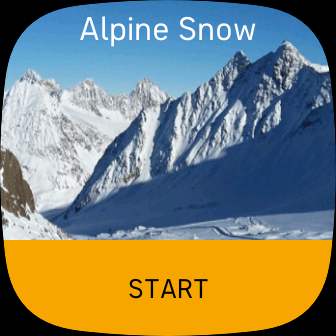

# Alpine Snow

Have you always wanted to take your Fitbit onto the slopes, and capture
important statistics like:

- distance travelled
- number of runs
- current speed
- max speed
- altitude
- weather conditions
- calories burned
- heart rate

This app does all of that and more. It also creates an exercise session in the
Fitbit activity log so you can view your data, including heart rate in the
Fitbit mobile app, and on Fitbit.com. It even automatically pauses the activity
to exclude the lift rides!

**Please Note:**

I built this app without access to a ski slope, mountains, or snow. If you find
problems with the run counter, or other things, please post add Github issues,
or discuss in [this forum
thread](https://community.fitbit.com/t5/Fitbit-App-Gallery/Alpine-Snow-Support/m-p/3122541)
and I will try to fix the issues.

If you want to help improve the downhill run detection, or pressure altitude
calculation, please submit a pull request!

Thanks.

### Known Issues

- Number of "Runs" aren't persisted anywhere.
- Exercise appears as "bike" in Fitbit activity log.
- Speed indicator might be incorrect. "The max speed I reached was according the
  app, 6,9 km/h. For sure that must be at least 60-70 km/h.".

### Screenshot

